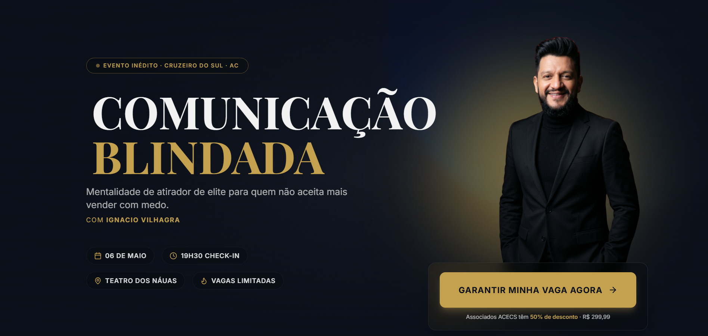

# Comunicação Blindada — Landing Page Oficial

Landing page desenvolvida para o evento presencial **Comunicação Blindada**, uma mentoria intensiva com foco em comunicação, oratória, negociação e autoridade profissional, conduzida por **Ignacio Vilhagra**.

O projeto foi criado com foco total em conversão, utilizando uma estrutura estratégica de vendas, design premium e uma experiência visual sofisticada para direcionar o visitante ao checkout de pagamento do evento.

---

## 🔗 Acesso ao Site

👉 https://comunicacaoblindada.com/

---

## Sobre o projeto

A proposta desta landing page é apresentar o evento de forma persuasiva, gerar autoridade, despertar desejo e aumentar a conversão de ingressos.

A comunicação da página trabalha diretamente uma dor comum do público:

> Muitas pessoas perdem oportunidades, vendas e posicionamento por medo de falar, medo de negociar e medo de se posicionar.

O objetivo da mentoria é romper esse bloqueio e transformar profissionais comuns em pessoas que dominam sua comunicação, impõem autoridade e lideram o próprio mercado.

---

## Estrutura da landing page

A página foi desenvolvida com as seguintes seções:

* Hero Section de alto impacto
* Seção de dor e confronto emocional
* Autoridade do especialista
* Para quem é a mentoria
* Transformação (antes vs depois)
* Benefícios principais
* Oferta especial
* Apoio institucional
* CTA final de fechamento
* Rodapé institucional

---

## Identidade visual

A landing page segue um padrão visual premium com foco em autoridade e sofisticação.

### Paleta principal

* Azul marinho profundo
* Dourado premium
* Branco para contraste
* Tons sutis de cinza escuro

### Estilo visual

* Sofisticado
* Elegante
* Executivo
* Premium
* Alta conversão
* Forte percepção de autoridade

---

## Tecnologias utilizadas

Este projeto foi desenvolvido utilizando:

* HTML
* CSS
* JavaScript
* ReactJS
* Layout responsivo
* Integração com checkout externo

---

## Diferenciais

* Copy altamente persuasiva
* Estrutura pensada para conversão
* Visual premium e estratégico
* CTA distribuídos de forma inteligente
* Sensação de urgência e escassez
* Direcionamento para checkout externo

---

## Objetivo final

Mais do que uma landing page bonita, este projeto foi criado para gerar resultado.

O foco principal é transformar visitantes em compradores, posicionando o evento como uma oportunidade exclusiva, valiosa e urgente para quem deseja evoluir profissionalmente através da comunicação.

O foco principal é transformar visitantes em compradores, posicionando o evento como uma oportunidade exclusiva, valiosa e urgente para quem deseja evoluir profissionalmente através da comunicação.
